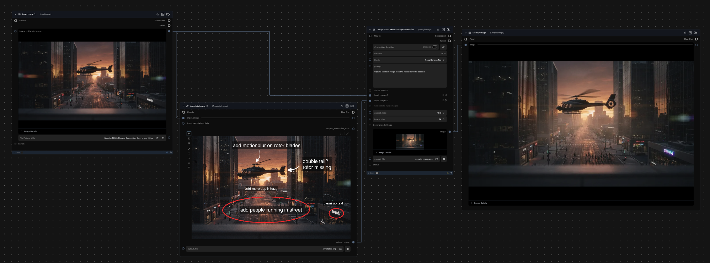
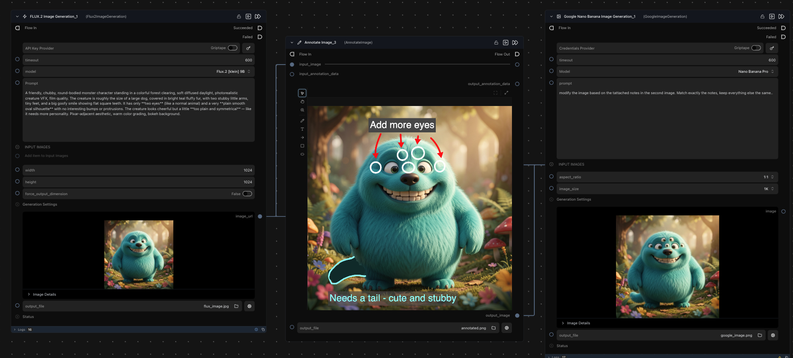

# Annotate Image

A [Griptape Nodes](https://www.griptapenodes.com/) library for drawing directly on images — no external tools required. Add paint strokes, labels, arrows, boxes, and ellipses right inside your workflow, then pass the result downstream to any node that accepts an image.


---

## Why Annotate?

When you're directing an AI, a picture with notes is worth more than any text prompt.

Instead of writing "the thing in the upper-left corner — make it smaller and move it toward the center," you can just draw an arrow and a box around it. Annotation bridges the gap between what you see and what you mean.

Use it to:

- **Show exactly what needs to change** — no ambiguous descriptions, just marks on the pixels that matter
- **Give clear creative direction** — arrows, shapes, and labels cut through the guesswork
- **Build tighter workflows** — annotate inside Griptape Nodes and connect the result directly to generation or editing nodes without leaving the canvas
- **Document visual intent** — annotated images carry their own context, making it easy for collaborators (or AI) to understand what you're after

---

## The Annotate Image Node

The library adds one node: **Annotate Image**.

Drop it into a flow, connect an incoming image (or leave it blank to start fresh), draw your notes, and wire the output into whatever comes next.



### Drawing Tools

| Tool | Shortcut | What it's for |
|---|---|---|
| Draw | `D` | Freehand painting — works like a brush |
| Text | `T` | Drop a text label anywhere on the image |
| Arrow | `L` | Point at something specific |
| Rectangle | `R` | Box in a region of interest |
| Ellipse | `O` | Circle or oval callouts |



### Navigation Tools

| Tool | Shortcut | What it's for |
|---|---|---|
| Select & Move | `V` | Pick, move, or resize any annotation |
| Pan | `H` | Scroll the canvas without selecting anything |
| Zoom | `Z` | Zoom in for detail work |
| Fit to Window | `F` | Snap the view so the whole canvas is visible |

### Working with Annotations

Once you've placed annotations, you can keep them organized:

- **Group / ungroup** — lock multiple annotations together so they move as one
- **Layer order** — bring an annotation to the front or push it to the back
- **Delete selected** — remove just what you've selected
- **Delete all** — wipe the canvas and start over
- **Expand to modal** — open a larger view when you need more room to work

### Chaining Annotation Nodes

You can feed the output of one **Annotate Image** node into the input of another. Upstream annotations arrive as a separate layer alongside your own, and each one can be independently overridden or reset.

A practical use for this is **annotation templates** — a first node holds a standard set of labels (shot number, scene, camera, notes fields) that gets stamped onto every image that flows through it. A second node then receives that template layer and lets you fill in the specifics for each individual shot without touching the template itself.


### Saving and Loading Annotations

The annotations value on the node is plain JSON, which means you can save it to disk and reload it in a later session — or share it with someone else who can drop it straight into their own **Annotate Image** node.

You can also **build annotation sets programmatically** using a **JSON Input** node wired into the annotations input. This is useful for generating consistent labels from data, pre-populating a shot template from a spreadsheet, or scripting repeatable overlays without drawing anything by hand.

The annotations format is a JSON object with an `annotations` array. Each entry describes one mark:

```json
{
  "annotations": [
    {
      "id": "text-1",
      "type": "text",
      "text": "Shot Description",
      "x": 10,
      "y": 10,
      "rotation": 0,
      "color": "#96fdfb",
      "font_size": 48,
      "text_align": "left",
      "bg_color": "#4f4f4fa6"
    }
  ]
}
```

Every annotation has an `id` (unique string), a `type` (`text`, `arrow`, `rect`, `ellipse`, or `paint`), and type-specific properties for position, color, size, and style. You can hand-author these in a JSON Input node, generate them from a script, or copy them out of an existing **Annotate Image** node to use as a starting point.


---

## Installation

1. In Griptape Nodes, open **Manage → Library Management**
2. Paste in the repository URL: `https://github.com/griptape-ai/griptape-nodes-library-annotate.git`
3. Click **Download**

That's it. Once installed, look for **Annotate Image** in the `image` category in the node picker.

---

## License

Apache License 2.0
